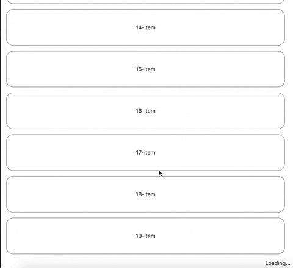

# use-infinite-scroll
A custom react hook for listening the end of the scroll to support load more feature.

# Requirement
To use this hook, you must be on react@16.8.0 or greater than that.

# Demo 


# Installation

### Using npm : 

`npm install react-use-load-more` 

### Using yarn : 

`yarn add react-use-load-more`

# Usage : 

```import useInfiniteScroll from "react-use-load-more";

const App = () => {
  const handleLoadMore = () => {
    // fetch more data
  };
  const hasMoreItems = true;
  const [isLoading] = useInfiniteScroll(handleLoadMore, hasMoreItems);
  return <>{isLoading ? "your loading component" : null}</>;
};

